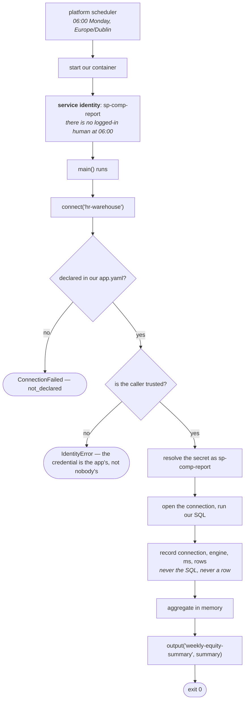

# comp-report

A scheduled job on [Insights Hub](https://github.com/KRISHNABR/insights-platform), owned by
**people-analytics**. Runs every Monday at 06:00 and reports salary spread by department.

It reads compensation data — the most sensitive thing any app here touches — which is what
makes it the interesting example. Almost none of what makes that safe is in this repo.

---

## What we wrote, and what we got

| We wrote | |
|---|---|
| [`src/main.py`](src/main.py) — a `main()` that queries, aggregates, writes an output | ~35 lines |
| [`app.yaml`](app.yaml) — our contract, including the operational one for the job | |

| We inherited | |
|---|---|
| The schedule. **We do not run cron** |
| A service identity — a 06:00 run has no logged-in human |
| Timeout, retries, concurrency control, catch-up suppression |
| The connector, and a credential we never see the value of |
| Structured logs that cannot carry a salary |
| An output artefact with a retention |
| Four pipelines across three environments, and [`RUNBOOK.md`](RUNBOOK.md) |

---

## Setup

```bash
uv sync
uv run insights doctor      # the same checks CI runs
uv run insights run         # run the job now, exactly as the platform runs it
```

Needs Python 3.12 and [uv](https://docs.astral.sh/uv/). `insights run` seeds the local stub
warehouse if it is missing, so a fresh clone just works.

You should see a `query_executed` record naming the connection, three `report_complete`
departments, and a CSV in `outputs/`.

---

## Who this runs as, and why it matters

A 06:00 run has no logged-in human, so it acts as **`sp-comp-report`** — derived by the
platform from our registered app name. We do not declare it and cannot change it.

That matters because access is granted *to an identity*. If we could name our own, we could
claim another app's and inherit whatever it can read.

**People Analytics granted `sp-comp-report` access in the data platform — not here.** This
platform grants nothing, holds no catalog, and has no command that pretends to. We already
had this access; what we get from the platform is the connector and somewhere safe for the
credential.

```yaml
connections:
  - name: hr-warehouse
    engine: sqlite               # databricks-sql in dev and prod
    path: ...
    secret: hr-warehouse-token   # a NAME. The value lives in the secret store
```

| | |
|---|---|
| writes the value | **our group** |
| reads the value | `sp-comp-report`, on its own prefix only |
| **cannot** read it | the platform team, by explicit IAM `Deny` |
| sees every read | CloudTrail, including theirs |

A password typed into `app.yaml` would be in git history forever, so the manifest loader
refuses one outright.

---

## How a run works



Exit codes are a contract: **0** succeeded · **1** the job broke · **2** the platform refused
it. The scheduler retries 1 and 2 differently, because a refusal will not fix itself.

---

## Our telemetry cannot leak compensation

```python
log.info("report_complete", departments=3, rows=4)     # ✅ the shape
log.info("debug", rows=rows)                           # ❌ RedactionError
```

The logger raises on anything that is not a scalar, **at the point of writing** — not
scrubbed later at the sink, because scrubbing at the sink fails open: a pattern nobody
anticipated goes straight through.

The platform's own record of this run is `connection=hr-warehouse engine=sqlite ms=2 rows=4`.
Not the SQL — SQL carries table and column names and often a literal in a `WHERE` clause, and
a platform-wide log of tenant SQL is a data inventory nobody agreed to.

---

## The operational contract

```yaml
job:
  schedule: "0 6 * * MON"
  timezone: Europe/Dublin     # explicit. "UTC vs local" causes one real incident per platform
  timeout: 30m                # SIGTERM at 30m, SIGKILL 30s later
  retries: 2                  # then on_failure pages our owners
  concurrency: forbid         # skip this run if the last one is still going
  catchup: false              # after an outage, do NOT fire a burst of missed runs
```

`concurrency: forbid` and the fire-once-per-minute guard live in the scheduler's SQLite run
state, so they survive a scheduler restart.

**In dev, `schedule_enabled: false`.** The job deploys but will not fire on its own — nobody
wants a half-finished report emailing people at 06:00.

---

## Local vs production

| Concern | Local | Production | Changes in `src/` |
|---|---|---|---|
| Scheduling | a Python cron matcher | EventBridge Scheduler → RunTask | nothing |
| Identity | the scheduler builds `sp-comp-report` | workload identity federation | nothing |
| The warehouse | sqlite | Databricks SQL | nothing — swap `engine:` and `host:` |
| The credential | a file in the fake store | Secrets Manager, scoped to this app | nothing |
| Column masking | — | **Unity Catalog**, per principal, on every path | nothing |
| Outputs | a local directory | an S3 prefix with a lifecycle rule | nothing |

**The line to notice:** masking is Unity Catalog's, applied to every reader on every path — a
notebook querying the same table gets the same masks this job does. There is nothing in this
repo we could edit to widen what we read, because the decision is not made here.

---

*Start at the [platform README](https://github.com/KRISHNABR/insights-platform), then
[ONBOARDING.md](https://github.com/KRISHNABR/insights-platform/blob/main/ONBOARDING.md).
Day-two operations for this app are in [RUNBOOK.md](RUNBOOK.md).*
