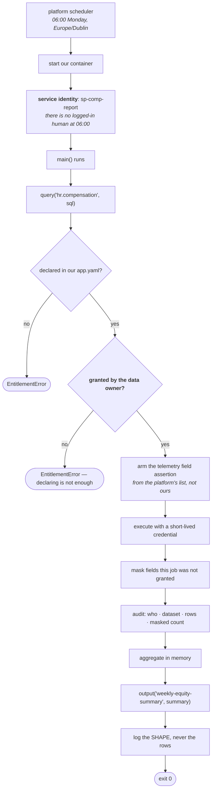
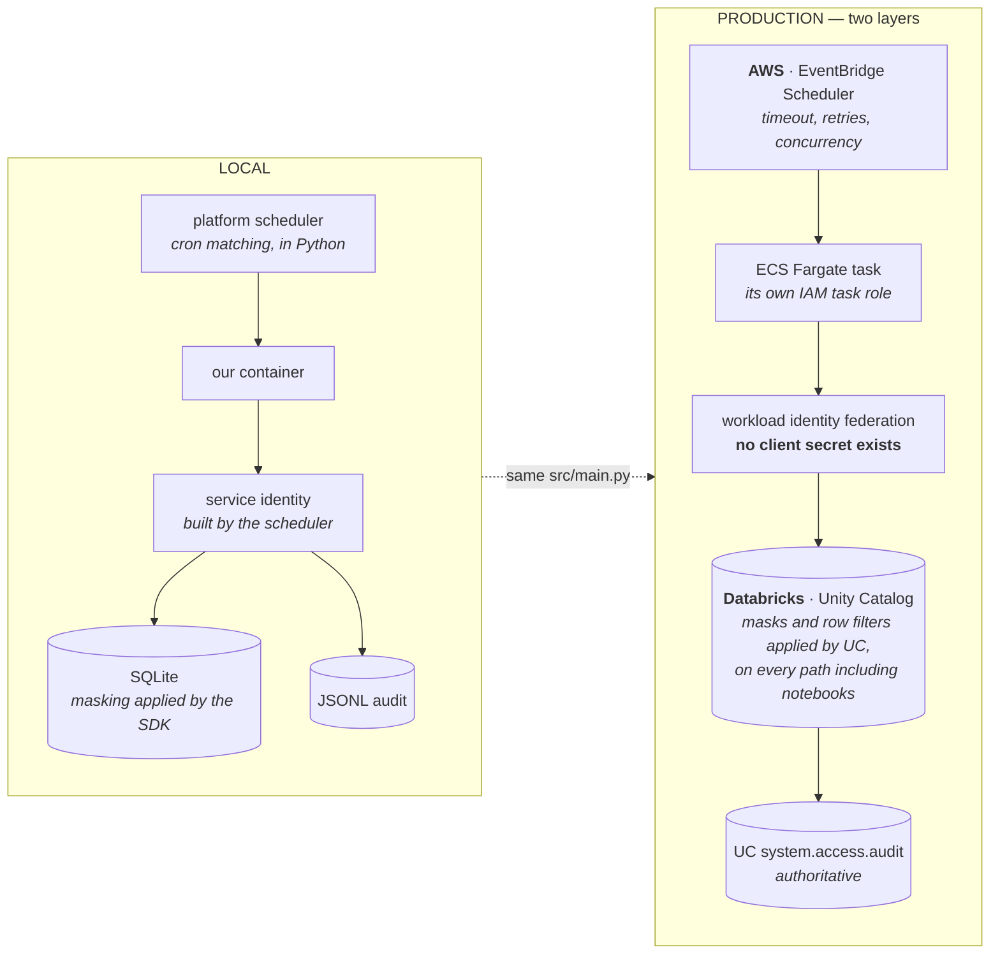

# comp-report

A scheduled job on [Insights Hub](https://github.com/KRISHNABR/insights-platform), owned by
**people-analytics**. Runs every Monday at 06:00 and reports salary spread by department.

It reads `hr.compensation` — **the most sensitive dataset the platform holds** — which makes it
the interesting example. None of the machinery that makes that safe appears in this repo.

---

## What we wrote, and what we got

| We wrote | |
|---|---|
| [`src/main.py`](src/main.py) — a `main()` that queries, aggregates, writes an output | ~40 lines |
| [`app.yaml`](app.yaml) — our contract, including the operational contract for the job | |

| We inherited | |
|---|---|
| The schedule. **We do not run cron** | |
| A service identity — a 06:00 run has no logged-in human | |
| Timeout, retries, concurrency control, catch-up suppression | |
| Data access, the owner's grant check, field masking | |
| Structured logs, metrics, an audit record per read | |
| The container image, and four pipelines across three environments | |

---

## Setup

```bash
mkdir insights-hub && cd insights-hub
for r in insights-platform insights-sdk insights-headcount-dashboard insights-comp-report; do
  git clone "https://github.com/KRISHNABR/$r.git"
done

cd insights-comp-report
uv run insights doctor      # checks our manifest AND that our grant exists
uv run insights run         # run the job now, exactly as the platform runs it
```

Needs Python 3.12 and [uv](https://docs.astral.sh/uv/). `insights run` seeds the local stub
warehouse if it is missing, so a fresh clone just works.

You should see an audit record with `"via_grant": true`, three `dept_summary` events, and a CSV
in `outputs/`.

---

## The operational contract — [`app.yaml`](app.yaml)

A job raises questions a web app does not. Each one is **declared**, not assumed:

```yaml
job:
  schedule: "0 6 * * MON"
  timezone: Europe/Dublin     # explicit. "UTC vs local" causes a real incident once per platform
  timeout: 30m                # SIGTERM at 30m, SIGKILL 30s later
  retries: 2                  # then on_failure pages our owners
  concurrency: forbid         # skip this run if the last one is still going
  catchup: false              # after an outage, do NOT fire a burst of missed runs
  on_failure: notify-owners

outputs:
  - name: weekly-equity-summary
    kind: file
    format: csv
    retention: 90d            # the platform expires it. We do not cron a cleanup
```

We name the artefact; the platform decides where it physically lives, who can read it, and when
it expires. Same "declare, don't wire" rule as data access, pointed the other way.

**In dev, `schedule_enabled: false`.** The job deploys but will not fire on its own — nobody
wants a half-finished report emailing people at 06:00.

---

## How a run works



Exit codes are a contract: **0** succeeded · **1** the job broke · **2** the platform refused it.
The scheduler retries 1 and 2 differently, because a refusal will not fix itself.

---

## Why this example is the interesting one

### Our job runs as its own identity, and that is the point

A 06:00 run has no logged-in human, so it acts as **`sp-comp-report`** — derived by the platform
from our registered app name. We do not declare it and cannot change it.

That matters because data access is granted *to an identity*. If we could name our own, we could
claim another app's and inherit whatever it can read.

People Analytics granted `sp-comp-report` read access on `hr.compensation` **in the data
platform** — not here. The platform cannot grant it and has no command that pretends to:

```bash
uv run insights access        # prints exactly what to ask, and who to ask
```

`insights doctor` checks that the grant exists, so a missing one fails at our desk rather than at
06:00 on Monday.

### Masking is the data platform's job, not ours

In production, column masks are applied by the data platform per principal — so whatever
`sp-comp-report` may see is what we get, and a notebook reading the same table sees the same
thing. Our manifest has no say in it at all.

That is worth noticing because it is what makes the design safe *without* extra machinery: there
is nothing in this repo we could edit to widen what we read.

### Our telemetry cannot leak compensation

```python
log.info("dept_summary", dept=dept, employees=len(salaries), spread_pct=9.4)   # ✅
log.info("debug", rows=rows)                                                    # ❌ RedactionError
```

The logger raises on anything that is not a scalar, **at the point of writing** — not scrubbed
later at the sink, because scrubbing at the sink fails open. And once this job reads
`hr.compensation`, the logger additionally refuses any record mentioning a *field name* from
that dataset. That list comes from the platform, so we cannot shorten it.

---

## Local vs production — AWS + Databricks



| Concern | Local | Production | Changes in `src/` |
|---|---|---|---|
| Scheduling | Python cron matcher | EventBridge Scheduler → ECS RunTask | nothing |
| **M2M identity** | scheduler builds `sp-comp-report` | **workload identity federation** from the task role — OIDC, no stored secret | nothing |
| Data | SQLite | Databricks SQL Warehouse | nothing |
| **Masking** | the SDK applies it | **Unity Catalog** applies it, per principal | nothing |
| **The grant** | `grants.yaml` | a Unity Catalog `GRANT`, owned by People Analytics | nothing |
| Audit | JSONL file | UC audit + our correlation record | nothing |
| Outputs | a local directory | an S3 prefix scoped to this app, with a lifecycle rule from `retention` | nothing |

**The line to notice:** in production our masking code does not run at all. Unity Catalog does
it, for every reader on every path — a notebook gets the same masks this job does. The platform
stops owning a governance model beside the data platform's, which is both less code and a
stronger guarantee.

### What a compliance reviewer is handed

```bash
insights compliance-report --dataset hr.compensation
```

Who is entitled, who granted it and when, every read in the period with caller and row count,
every break-glass event with its approver and expiry, and the redaction assertion status.
Nothing in that output is asserted by the command — it is all read from the registry and the
audit trail.

---

*Start at the [platform README](https://github.com/KRISHNABR/insights-platform), then
[ONBOARDING.md](https://github.com/KRISHNABR/insights-platform/blob/main/ONBOARDING.md).*
